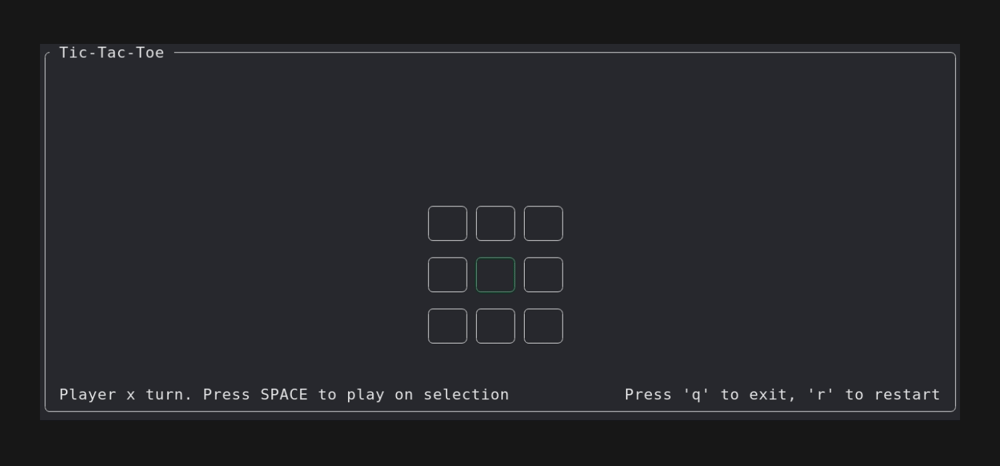

Tic-tac-toe in Rust

Project goals:
- [x] Get more familiar with Rust 
- [x] Learn to use a TUI. Used the awesome Ratatui crate (https://github.com/ratatui-org/ratatui)

Gif was made using VHS (https://github.com/charmbracelet/vhs)